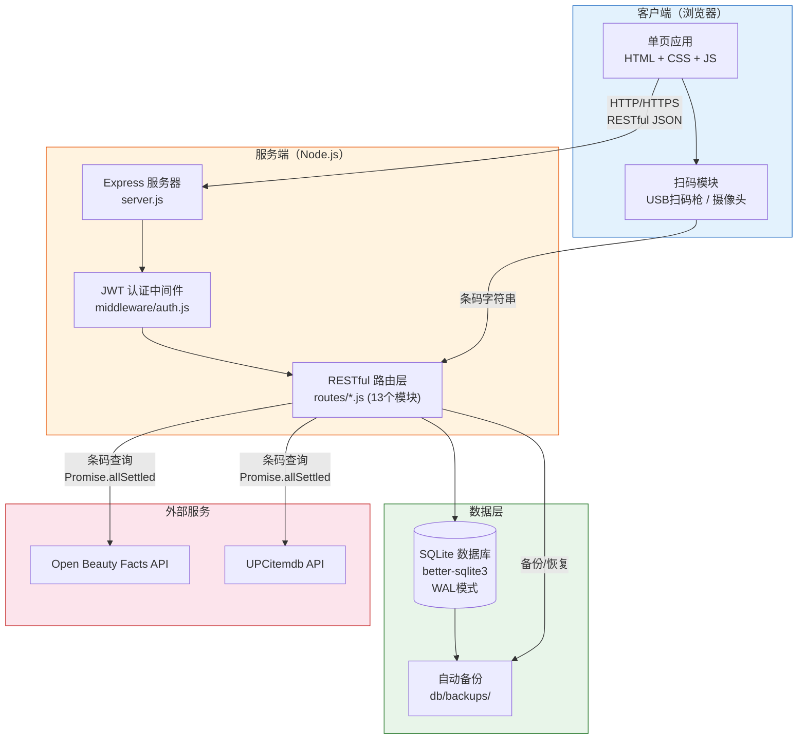
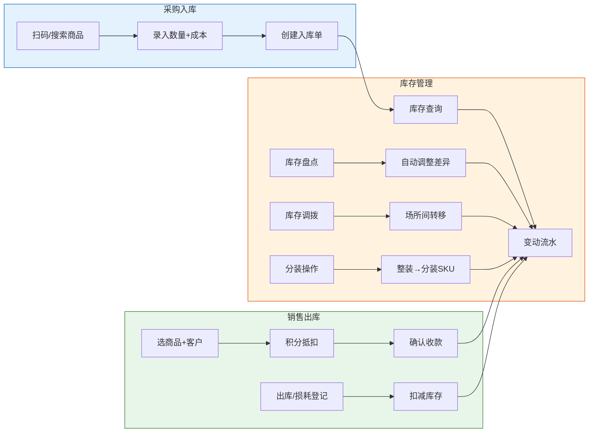
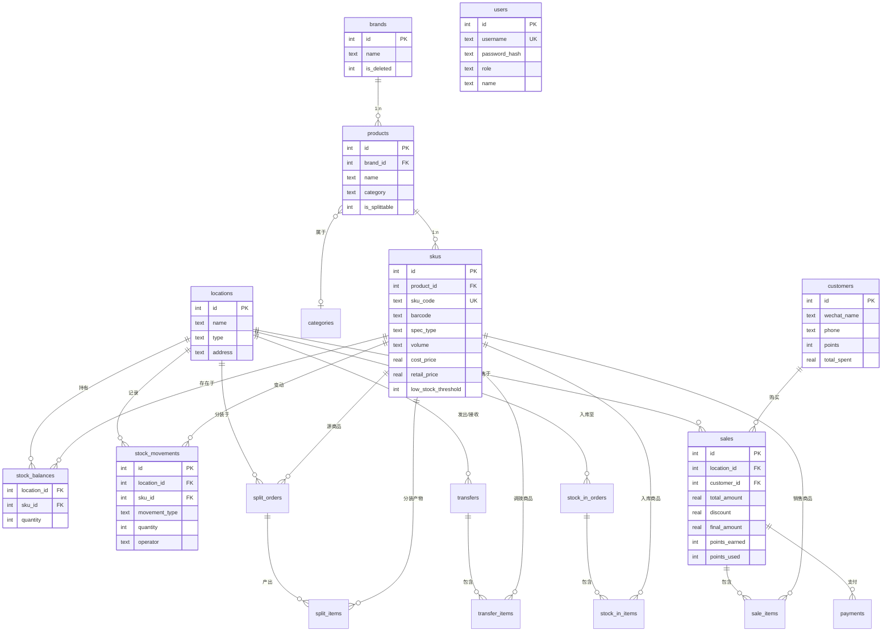
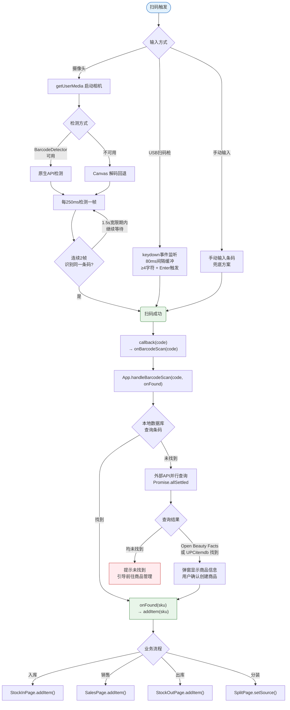

# FleetingERP - 香氛零售库存管理系统

> 为香氛零售门店设计的轻量级 ERP 系统，聚焦 SKU 库存管理、扫码入库、销售开单与盘点，帮助门店高效运营。

## 项目概览

FleetingERP 是一套面向香氛零售行业的库存管理工具，覆盖从进货入库到销售出库的完整业务链路。系统支持 USB 扫码枪与摄像头扫码识别，可对接外部条码数据库自动获取商品信息，大幅减少人工录入成本。

### 核心特性

- **扫码入库** — 支持 USB 扫码枪 + 摄像头扫码，三级回退策略（本地数据库 → 外部条码API → 手动输入）
- **SKU 管理** — 商品/品牌/品类/规格多层级管理，支持整装与分装 SKU
- **库存流转** — 入库、出库、损耗、分装、调拨全链路库存变动追踪
- **销售开单** — 快速开单、积分抵扣、多种支付方式、小票打印
- **库存盘点** — 实盘数量录入，自动计算差异并调整库存
- **数据安全** — 自动每日备份、一键恢复、XSS 防护、登录限流
- **多端适配** — 响应式布局，手机/平板/电脑均可使用

## 技术栈

| 层级 | 技术选型 | 说明 |
|------|---------|------|
| 前端 | 原生 HTML + CSS + JavaScript | 无框架依赖，加载快，维护简单 |
| 后端 | Node.js + Express | RESTful API，JSON 通信 |
| 数据库 | SQLite (better-sqlite3) | 嵌入式数据库，零配置，WAL 模式 |
| 认证 | JWT + bcrypt | 无状态认证，密码哈希存储 |
| 进程管理 | PM2 | 自动重启、开机自启、日志管理 |
| 条码识别 | BarcodeDetector API + Canvas 解码 | 原生优先，Canvas 回退 |

## 系统架构图

### 整体架构



### 业务流程图



## 项目结构

```
FleetingERP/
├── server.js                 # 应用入口，Express 服务器启动
├── package.json              # 依赖与脚本
├── ecosystem.config.js       # PM2 进程管理配置
├── .env.example              # 环境变量模板
├── deploy.sh                 # 一键部署脚本
├── DEPLOY.md                 # 部署指南
│
├── middleware/
│   └── auth.js               # JWT 认证中间件
│
├── routes/                   # 后端 API 路由
│   ├── auth.js               #   认证/用户管理
│   ├── brands.js             #   品牌管理
│   ├── products.js           #   商品/品类/SKU管理
│   ├── skus.js               #   条码查询与外部API对接
│   ├── locations.js          #   仓库/门店管理
│   ├── stock.js              #   库存查询/变动/盘点
│   ├── stockIn.js            #   入库
│   ├── stockOut.js           #   出库/损耗
│   ├── split.js              #   分装操作
│   ├── transfer.js           #   库存调拨
│   ├── sales.js              #   销售开单/历史
│   ├── customers.js          #   客户/积分管理
│   └── system.js             #   Dashboard/备份/恢复
│
├── utils/
│   ├── db.js                 # SQLite 初始化/迁移/自动备份
│   └── barcode.js            # 外部条码API (OpenBeautyFacts/UPCitemdb)
│
├── db/
│   ├── schema.sql            # 数据库表结构定义
│   └── seed.sql              # 初始示例数据
│
├── public/                   # 前端静态资源
│   ├── index.html            #   单页应用入口
│   ├── css/
│   │   └── style.css         #   全局样式 (响应式)
│   └── js/
│       ├── app.js            #   应用主体 (路由/导航/全局逻辑)
│       ├── api.js            #   API 请求封装
│       ├── pages/            #   功能页面模块
│       │   ├── dashboard.js      #   首页仪表盘
│       │   ├── stockIn.js        #   入库 (扫码入库)
│       │   ├── stockOut.js       #   出库/损耗登记
│       │   ├── split.js          #   分装操作
│       │   ├── transfer.js       #   库存调拨
│       │   ├── stockQuery.js     #   库存查询
│       │   ├── movements.js      #   变动流水
│       │   ├── inventoryCheck.js #   库存盘点
│       │   ├── sales.js          #   销售开单+历史+小票
│       │   ├── customers.js      #   客户管理
│       │   ├── products.js       #   商品/品牌/品类管理
│       │   └── settings.js       #   系统设置/用户/备份
│       └── utils/            #   前端工具库
│           ├── scanner.js        #   扫码枪+相机扫码核心
│           ├── barcodeReader.js  #   Canvas 条码解码
│           ├── searchSuggest.js  #   搜索建议下拉
│           └── formatter.js      #   格式化/XSS转义
│
└── logs/                     # 运行日志 (PM2生成)
```

## 数据模型

系统包含 13 张核心数据表，ER 关系如下：



### 库存变动类型

| 类型 | 标识 | 说明 |
|------|------|------|
| 入库 | `in` | 采购入库 |
| 出库 | `out` | 手动出库 |
| 销售 | `sale` | 销售出库 |
| 分装 | `split` | 整装拆分为分装 |
| 调入 | `transfer_in` | 调拨接收 |
| 调出 | `transfer_out` | 调拨发出 |
| 损耗 | `loss` | 损耗登记 |
| 盘盈 | `check_in` | 盘点调整(增加) |
| 盘亏 | `check_out` | 盘点调整(减少) |

## API 接口一览

| 模块 | 方法 | 路径 | 说明 |
|------|------|------|------|
| 认证 | POST | `/api/auth/login` | 登录 |
| | PUT | `/api/auth/change-password` | 修改密码 |
| | GET | `/api/auth/me` | 获取当前用户 |
| | GET/POST/DELETE | `/api/auth/users` | 用户管理 |
| 品牌 | GET/POST/PUT/DELETE | `/api/brands` | 品牌 CRUD |
| 商品 | GET/POST/PUT/DELETE | `/api/products` | 商品 CRUD |
| | POST | `/api/products/:id/skus` | 添加 SKU |
| | GET/POST/DELETE | `/api/products/categories` | 品类管理 |
| 条码 | GET | `/api/skus/barcode/:code` | 本地条码查询 |
| | GET | `/api/skus/barcode/lookup/:code` | 外部条码查询 |
| 场所 | GET/POST/PUT/DELETE | `/api/locations` | 仓库/门店 CRUD |
| 库存 | GET | `/api/stock/balances` | 库存余额 |
| | GET | `/api/stock/movements` | 变动流水 |
| | GET | `/api/stock/alerts` | 库存预警 |
| | POST | `/api/stock/check` | 盘点 |
| 入库 | POST | `/api/stock-in` | 创建入库单 |
| 出库 | POST | `/api/stock-out` | 创建出库单 |
| | POST | `/api/stock-out/batch` | 批量出库 |
| 分装 | POST | `/api/split` | 创建分装单 |
| 调拨 | GET/POST | `/api/transfer` | 调拨管理 |
| 销售 | POST | `/api/sales` | 创建销售单 |
| | GET | `/api/sales` | 销售历史 |
| | GET | `/api/sales/:id` | 销售详情 |
| 客户 | GET/POST/PUT/DELETE | `/api/customers` | 客户 CRUD |
| | GET | `/api/customers/:id/purchases` | 客户购买记录 |
| 系统 | GET | `/api/system/dashboard` | 仪表盘数据 |
| | GET | `/api/system/backup` | 手动备份 |
| | GET | `/api/system/export-excel` | 导出Excel |
| | GET | `/api/system/backups` | 备份列表 |
| | POST | `/api/system/restore` | 数据恢复 |

## 快速开始

### 环境要求

- Node.js 18+
- npm 9+

### 本地开发

```bash
# 克隆仓库
git clone git@github.com:Tia-Han/FleetingERP.git
cd FleetingERP

# 安装依赖
npm install

# 启动开发服务器
npm run dev

# 浏览器访问
open http://localhost:3000
```

默认账号: `admin` / `admin123`（首次登录后请修改密码）

### 生产部署

详见 [DEPLOY.md](./DEPLOY.md)，支持 PM2 + 阿里云 ECS 一键部署。

```bash
# 服务器上一键部署
bash deploy.sh
```

## 扫码链路架构

系统最重要的功能是扫码入库，完整链路如下：



### 扫码稳定性保障

- 相机检测使用 `_detectionStarted` 标志防止双重初始化
- `_scanCompleted` 标志确保同一商品不会被重复添加
- 1.5秒宽限期防止条码漏检导致计数重置
- `stopCamera()` 完整清理 video.srcObject 和 MediaStream tracks
- 外部 API 使用 `Promise.allSettled` 并行查询，最长等待 8 秒

## 角色权限

| 角色 | 标识 | 权限 |
|------|------|------|
| 管理员 | `admin` | 全部功能 + 用户管理 |
| 仓库管理员 | `warehouse_manager` | 入库/出库/分装/调拨/盘点/库存查询 |
| 店员 | `store_clerk` | 销售/客户/库存查询/变动流水 |

## License

[MIT](./LICENSE)
